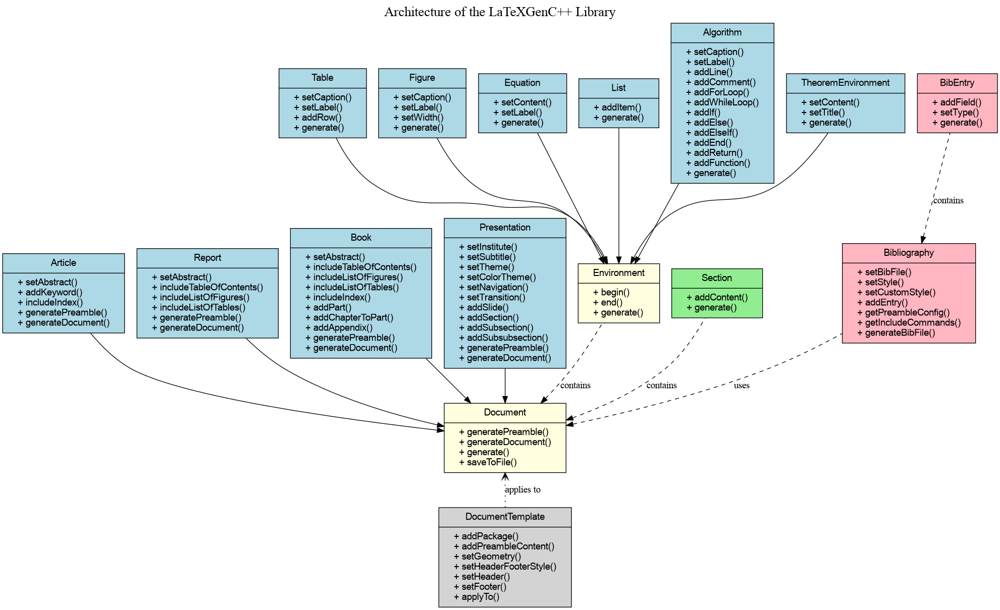

# LatexGenC++ - Documentation détaillée

## Table des matières

1. [Introduction](#introduction)
2. [Architecture de la bibliothèque](#architecture-de-la-bibliothèque)
3. [Types de documents](#types-de-documents)
   - [Article](#article)
   - [Rapport](#rapport)
   - [Livre](#livre)
   - [Présentation](#présentation)
4. [Structuration du contenu](#structuration-du-contenu)
   - [Sections, sous-sections et paragraphes](#sections-sous-sections-et-paragraphes)
   - [Chapitres et parties](#chapitres-et-parties)
   - [Annexes](#annexes)
5. [Éléments de contenu](#éléments-de-contenu)
   - [Texte et formatage](#texte-et-formatage)
   - [Listes](#listes)
   - [Tableaux](#tableaux)
   - [Figures](#figures)
   - [Équations](#équations)
   - [Théorèmes](#théorèmes)
   - [Algorithmes](#algorithmes)
6. [Bibliographie](#bibliographie)
   - [Utilisation d'un fichier .bib externe](#utilisation-dun-fichier-bib-externe)
   - [Création manuelle des entrées bibliographiques](#création-manuelle-des-entrées-bibliographiques)
   - [Styles bibliographiques](#styles-bibliographiques)
   - [Citations](#citations)
7. [Index](#index)
8. [Support multilingue](#support-multilingue)
9. [Personnalisation avancée](#personnalisation-avancée)
   - [Modèles de document](#modèles-de-document)
   - [Paquets et préambule](#paquets-et-préambule)
10. [Exemples complets](#exemples-complets)
11. [Référence API](#référence-api)
12. [Dépannage](#dépannage)
13. [Compilation des documents](#compilation-des-documents)


## Introduction

LatexGenC++ est une bibliothèque C++ qui permet la génération programmatique de documents LaTeX. La bibliothèque offre une approche orientée objet pour créer différents types de documents LaTeX, notamment des articles scientifiques, des rapports techniques, des livres et des présentations Beamer.

L'objectif principal de LatexGenC++ est de simplifier la création de documents LaTeX en utilisant du code C++, ce qui est particulièrement utile pour les cas où le contenu du document doit être généré dynamiquement à partir de données ou de calculs.

## Architecture de la bibliothèque

LatexGenC++ est conçu selon une architecture orientée objet, avec une hiérarchie de classes qui reflète les différents types de documents et éléments LaTeX.

La classe de base `Document` définit l'interface commune à tous les types de documents, tandis que des classes dérivées comme `Article`, `Report`, `Book` et `Presentation` implémentent les fonctionnalités spécifiques à chaque type de document.

Les éléments de contenu comme les tableaux, figures, équations, etc., sont gérés par des classes dérivées de la classe de base `Environment`.



## Types de documents

### Article

La classe `Article` correspond au type de document LaTeX `article`. Elle est adaptée pour les articles scientifiques, les documents courts, et les publications académiques.

```cpp
// Création d'un article
Article article("Titre du document", "Nom de l'auteur", "Date");

// Ajout d'un résumé
article.setAbstract("Ceci est le résumé de l'article...");

// Ajout de mots-clés
article.addKeyword("LaTeX");
article.addKeyword("C++");
```

### Rapport

La classe `Report` correspond au type de document LaTeX `report`. Elle est conçue pour des documents plus longs comportant des chapitres, comme des rapports techniques ou des mémoires.

```cpp
// Création d'un rapport
Report report("Titre du rapport", "Nom de l'auteur", "Date");

// Activation de la table des matières
report.includeTableOfContents(true);

// Activation des listes de figures et tableaux
report.includeListOfFigures(true);
report.includeListOfTables(true);
```

### Livre

La classe `Book` correspond au type de document LaTeX `book`. Elle est destinée aux documents volumineux comportant des parties, des chapitres et divers éléments de début et de fin.

```cpp
// Création d'un livre
Book book("Titre du livre", "Nom de l'auteur", "Date");

// Ajout d'une partie
book.addPart("Première partie");

// Ajout d'un chapitre à une partie (index 0 = première partie)
Section chapter("Chapitre 1", Section::Level::CHAPTER);
book.addChapter(chapter, 0);

// Ajout d'une annexe
Section appendix("Annexe A", Section::Level::CHAPTER);
book.addAppendix(appendix);
```

### Présentation

La classe `Presentation` correspond au type de document LaTeX `beamer`. Elle permet de créer des présentations pour des conférences ou des cours.

```cpp
// Création d'une présentation
Presentation presentation("Titre de la présentation", "Nom de l'auteur", "Date");

// Configuration du thème
presentation.setTheme(PresentationTheme::MADRID);
presentation.setColorTheme(PresentationColorTheme::BEAVER);
presentation.setTransition(PresentationTransition::FADE);

// Ajout d'une diapositive
auto slide = std::make_shared<Slide>("Titre de la diapositive");
slide->addContent("Contenu de la diapositive");
presentation.addSlide(slide);

// Création de la structure (true = créer une diapositive pour cette section)
presentation.addSection("Introduction", true);
presentation.addSubsection("Contexte", false);
```

## Structuration du contenu

### Sections, sous-sections et paragraphes

La classe `Section` permet de créer des sections, sous-sections et sous-sous-sections dans les documents.

```cpp
// Création d'une section
Section section("Titre de la section", Section::Level::SECTION);

// Création d'une sous-section
Section subsection("Titre de la sous-section", Section::Level::SUBSECTION);

// Création d'une sous-sous-section
Section subsubsection("Titre de la sous-sous-section", Section::Level::SUBSUBSECTION);

// Ajout de contenu à une section
section.addContent("Texte de la section...");

// Ajout d'une sous-section à une section
section.addContent(subsection.generate());

// Ajout de la section au document
document.addSection(section);
```

### Chapitres et parties

Pour les rapports et les livres, vous pouvez utiliser des chapitres et des parties.

```cpp
// Création d'un chapitre
Section chapter("Titre du chapitre", Section::Level::CHAPTER);

// Pour les livres, vous pouvez organiser les chapitres en parties
book.addPart("Titre de la partie");
book.addChapter(chapter, 0); // Ajoute le chapitre à la première partie
```

### Annexes

Les annexes sont disponibles pour les rapports et les livres.

```cpp
// Création d'une annexe
Section appendix("Titre de l'annexe", Section::Level::CHAPTER);

// Ajout de l'annexe au document
book.addAppendix(appendix);
// ou
report.addAppendix(appendix);
```

## Éléments de contenu

### Texte et formatage

Vous pouvez ajouter du texte formaté aux sections à l'aide de la méthode `addContent`.

```cpp
// Ajout de texte simple
section.addContent("Texte normal.");

// Ajout de texte avec commandes LaTeX
section.addContent("Texte en \\textbf{gras} et en \\textit{italique}.");

// Ajout de contenu LaTeX brut
document.addRawContent("\\clearpage");
```

### Listes

La classe `List` permet de créer différents types de listes.

```cpp
// Création d'une liste à puces
auto itemize = std::make_shared<List>(List::ListType::ITEMIZE);
itemize->addItem("Premier élément");
itemize->addItem("Deuxième élément");

// Création d'une liste numérotée
auto enumerate = std::make_shared<List>(List::ListType::ENUMERATE);
enumerate->addItem("Étape 1");
enumerate->addItem("Étape 2");

// Création d'une liste de description
auto description = std::make_shared<List>(List::ListType::DESCRIPTION);
description->addItem("Terme 1", "Définition 1");
description->addItem("Terme 2", "Définition 2");

// Ajout de la liste à une section
section.addContent(itemize->generate());
```

Vous pouvez également utiliser les méthodes pratiques fournies par les classes de document :

```cpp
// Utilisation de la méthode addList
auto list = document.addList(List::ListType::ITEMIZE);
list->addItem("Élément 1");
list->addItem("Élément 2");
```

### Tableaux

La classe `Table` permet de créer des tableaux avec en-têtes et contenu.

```cpp
// Création d'en-têtes de colonnes
std::vector<std::string> headers = {"Colonne 1", "Colonne 2", "Colonne 3"};

// Création du tableau
auto table = std::make_shared<Table>(headers);
table->setCaption("Légende du tableau");
table->setLabel("tab:example");

// Ajout de lignes
table->addRow({"Valeur 1.1", "Valeur 1.2", "Valeur 1.3"});
table->addRow({"Valeur 2.1", "Valeur 2.2", "Valeur 2.3"});

// Ajout du tableau à une section
section.addContent(table->generate());
```

Vous pouvez également utiliser la méthode pratique :

```cpp
// Utilisation de la méthode addTable
auto table = document.addTable(
    headers,                  // En-têtes de colonnes
    "Légende du tableau",     // Légende
    "tab:example",            // Étiquette pour référence
    "htbp"                    // Position
);

// Ajout de lignes
table->addRow({"Valeur 1.1", "Valeur 1.2", "Valeur 1.3"});
```

### Figures

La classe `Figure` permet d'insérer des images dans les documents.

```cpp
// Création d'une figure
auto figure = std::make_shared<Figure>("chemin/vers/image.png");
figure->setCaption("Légende de la figure");
figure->setLabel("fig:example");
figure->setWidth("0.7\\textwidth");

// Ajout de la figure à une section
section.addContent(figure->generate());
```

Vous pouvez également utiliser la méthode pratique :

```cpp
// Utilisation de la méthode addFigure
auto figure = document.addFigure(
    "chemin/vers/image.png",     // Chemin de l'image
    "Légende de la figure",      // Légende
    "fig:example",               // Étiquette pour référence
    "0.7\\textwidth",            // Largeur
    "htbp"                       // Position
);
```

### Équations

La classe `Equation` permet d'ajouter des équations mathématiques.

```cpp
// Création d'une équation
auto equation = std::make_shared<Equation>("E = mc^2");
equation->setLabel("eq:einstein");
equation->setNumbered(true);

// Ajout de l'équation à une section
section.addContent(equation->generate());
```

Vous pouvez également utiliser les méthodes pratiques :

```cpp
// Utilisation de la méthode addEquation
auto equation = document.addEquation(
    "E = mc^2",             // Contenu de l'équation
    "eq:einstein",          // Étiquette pour référence
    true                    // Équation numérotée
);

// Ajout d'une équation en ligne
std::string inlineEq = document.addInlineEquation("F = ma");
document.addRawContent("La formule " + inlineEq + " est la seconde loi de Newton.");
```

### Théorèmes

La classe `TheoremEnvironment` permet de créer des environnements de théorème.

```cpp
// Création d'un théorème
auto theorem = document.addTheorem(
    TheoremEnvironment::Type::THEOREM,     // Type de théorème
    "A + B = B + A",                       // Contenu du théorème
    "Commutativité de l'Addition"          // Titre du théorème (facultatif)
);
```

Différents types de théorèmes sont disponibles :
- `THEOREM` : Théorème
- `LEMMA` : Lemme
- `COROLLARY` : Corollaire
- `PROPOSITION` : Proposition
- `DEFINITION` : Définition
- `EXAMPLE` : Exemple
- `REMARK` : Remarque
- `PROOF` : Preuve

### Algorithmes

La classe `Algorithm` permet de créer des descriptions d'algorithmes formatées.

```cpp
// Création d'un algorithme
auto algorithm = document.addAlgorithm(
    "Tri à bulles",         // Légende
    "algo:bubblesort"       // Étiquette
);

// Configuration de l'algorithme
algorithm->addFunction("TriBulles", "A : tableau d'entiers");
algorithm->addForLoop("i = 1 \\textbf{à} taille(A)", 1);
algorithm->addForLoop("j = 1 \\textbf{à} taille(A) - i", 2);
algorithm->addIf("A[j] > A[j+1]", 3);
algorithm->addLine("échanger A[j] et A[j+1]", 4);
algorithm->addEnd("Si", 3);
algorithm->addEnd("Pour", 2);
algorithm->addEnd("Pour", 1);
algorithm->addReturn("A", 1);
algorithm->addFunctionEnd(0);
```

## Bibliographie

LatexGenC++ offre deux approches pour gérer les bibliographies :

### Utilisation d'un fichier .bib externe

Cette approche utilise un fichier .bib existant :

```cpp
// Création d'une bibliographie à partir d'un fichier externe
Bibliography biblio("references", BibStyle::IEEE);

// Ajout de la bibliographie au document
document.setBibliography(biblio);

// Ajout d'une citation
document.addRawContent("Selon " + document.cite("smith2023") + ", la théorie est valide.");
```

### Création manuelle des entrées bibliographiques

Cette approche permet de créer des références programmatiquement :

```cpp
// Création d'une bibliographie vide
Bibliography biblio;
biblio.setStyle(BibStyle::IEEE);

// Création d'une entrée de type article
BibEntry articleEntry("smith2023", BibEntry::EntryType::ARTICLE);
articleEntry.addField("author", "John Smith");
articleEntry.addField("title", "Introduction à la programmation LaTeX");
articleEntry.addField("journal", "Journal of Document Engineering");
articleEntry.addField("year", "2023");
articleEntry.addField("volume", "42");
articleEntry.addField("number", "1");
articleEntry.addField("pages", "123--456");

// Ajout de l'entrée à la bibliographie
biblio.addEntry(articleEntry);

// Création d'une entrée de type livre
BibEntry bookEntry("johnson2022", BibEntry::EntryType::BOOK);
bookEntry.addField("author", "Mark Johnson");
bookEntry.addField("title", "Advanced Document Engineering");
bookEntry.addField("publisher", "Technical Publishing House");
bookEntry.addField("year", "2022");
bookEntry.addField("address", "New York");

// Ajout de l'entrée à la bibliographie
biblio.addEntry(bookEntry);

// Génération du fichier .bib
biblio.generateBibFile("output");

// Utilisation de la bibliographie dans le document
document.setBibliography(biblio);

// Ajout de citations
document.addRawContent("Selon " + document.cite("smith2023") + ", la théorie est valide.");
document.addRawContent("Pour plus de détails, voir " + document.cite("johnson2022") + ".");
```

### Styles bibliographiques

LatexGenC++ prend en charge plusieurs styles bibliographiques courants :

- `BibStyle::PLAIN` : Style simple
- `BibStyle::ALPHA` : Style alphanumérique
- `BibStyle::ABBRV` : Style abrégé
- `BibStyle::IEEE` : Style IEEE
- `BibStyle::ACM` : Style ACM
- `BibStyle::APA` : Style APA
- `BibStyle::CHICAGO` : Style Chicago

Vous pouvez également définir un style personnalisé :

```cpp
biblio.setCustomStyle("nom-du-style-personnalisé");
```

### Citations

Plusieurs méthodes de citation sont disponibles :

```cpp
// Citation standard
document.addRawContent("Voir " + document.cite("smith2023") + ".");

// Citation textuelle
document.addRawContent("Comme indiqué dans " + document.citeAuthor("smith2023") + ".");

// Citation avec année
document.addRawContent("Cette théorie a été développée en " + document.citeYear("smith2023") + ".");

// Citation avec plusieurs références
document.addRawContent("Voir " + document.cite({"smith2023", "johnson2022"}) + ".");
```

## Index

LatexGenC++ permet de créer des index pour faciliter la navigation dans les documents.

```cpp
// Activer l'index
document.includeIndex(true);

// Ajouter des entrées d'index dans le contenu
section.addContent("Ceci est un exemple d'indexation. \\index{Indexation}");

// Entrée avec sous-entrée
section.addContent("LaTeX est puissant. \\index{LaTeX!Puissance}");

// Entrée avec formatage
section.addContent("Formatage d'index. \\index{Formatage|textbf}");

// Entrée avec renvoi
section.addContent("Référence croisée. \\index{Référence|see{Renvoi}}");
```

Pour compiler le document avec index, exécutez les commandes suivantes :
```
pdflatex document.tex
makeindex document.idx
pdflatex document.tex
```

## Support multilingue

LatexGenC++ prend en charge 11 langues différentes :

- `Language::ENGLISH` : Anglais
- `Language::FRENCH` : Français
- `Language::GERMAN` : Allemand
- `Language::SPANISH` : Espagnol
- `Language::ITALIAN` : Italien
- `Language::PORTUGUESE` : Portugais
- `Language::DUTCH` : Néerlandais
- `Language::RUSSIAN` : Russe
- `Language::JAPANESE` : Japonais
- `Language::CHINESE` : Chinois
- `Language::ARABIC` : Arabe

Spécifiez la langue lors de la création du document :

```cpp
// Création d'un document en français
Article article("Titre", "Auteur", "Date", Language::FRENCH);
```

## Personnalisation avancée

### Modèles de document

Les modèles permettent d'appliquer un style cohérent à plusieurs documents :

```cpp
// Création d'un modèle
DocumentTemplate academicTemplate("Académique");
academicTemplate.setGeometry("margin=2.5cm");
academicTemplate.setHeaderFooterStyle("fancy");
academicTemplate.setHeader("", "\\thetitle", "\\thepage");
academicTemplate.setFooter("\\theauthor", "", "\\today");
academicTemplate.addPackage("microtype");

// Application du modèle au document
academicTemplate.applyTo(document);
```

### Paquets et préambule

Vous pouvez personnaliser le préambule LaTeX :

```cpp
// Ajout de paquets
document.addPackage("listings");
document.addPackage("xcolor");
document.addPackage("graphicx");

// Ajout de configuration dans le préambule
document.addInPreamble("\\lstset{\n"
                       "  basicstyle=\\small\\ttfamily,\n"
                       "  keywordstyle=\\color{blue}\\bfseries,\n"
                       "  commentstyle=\\color{green!60!black}\\itshape\n"
                       "}");
```

## Exemples complets

Des exemples complets sont disponibles dans le répertoire `examples/` :

- `article_example.cpp` : Exemple d'article scientifique
- `report_example.cpp` : Exemple de rapport technique
- `book_example.cpp` : Exemple de livre
- `presentation_example.cpp` : Exemple de présentation Beamer
- `index_example.cpp` : Exemple d'utilisation de l'index
- `multilingual_example.cpp` : Exemple de document multilingue

## Référence API

Pour une documentation détaillée de l'API, consultez le fichier d'en-tête `include/latexgen.h`.

## Dépannage

### Problèmes de compilation LaTeX

Si vous rencontrez des problèmes lors de la compilation des documents LaTeX générés :

1. Vérifiez que LaTeX est correctement installé sur votre système
2. Assurez-vous que tous les paquets nécessaires sont installés
3. Vérifiez le fichier log LaTeX pour des informations détaillées sur les erreurs

### Encodage des caractères

Pour les documents avec des caractères spéciaux ou non-ASCII :

```cpp
// Ajout de support pour l'encodage UTF-8
document.addPackage("inputenc", "utf8");
document.addPackage("fontenc", "T1");
```

### Problèmes avec les figures

Si les figures ne s'affichent pas correctement :

1. Vérifiez que le chemin vers les images est correct
2. Assurez-vous que le format d'image est pris en charge par LaTeX (préférez PDF, PNG ou JPG)
3. Ajoutez le paquet `graphicx` en incluant `document.addPackage("graphicx");` dans votre code

### Problèmes de compilation avec la bibliographie

Si vous rencontrez des erreurs lors de la compilation avec bibliographie :

1. Assurez-vous d'exécuter `pdflatex`, puis `bibtex`, puis `pdflatex` deux fois
2. Vérifiez que les clés de citation dans le document correspondent bien aux clés dans le fichier .bib
3. Vérifiez la syntaxe des entrées bibliographiques, particulièrement les accolades et les guillemets

## Compilation des documents

Pour compiler un document LaTeX généré avec bibliographie et index :

```bash
# Première compilation
pdflatex document.tex

# Traitement de la bibliographie
bibtex document

# Traitement de l'index (si utilisé)
makeindex document.idx

# Compilations supplémentaires pour résoudre les références
pdflatex document.tex
pdflatex document.tex
```


Si vous avez des questions supplémentaires ou si vous souhaitez contribuer au développement de cette bibliothèque, n'hésitez pas à consulter le dépôt du projet ou à contacter l'auteur.